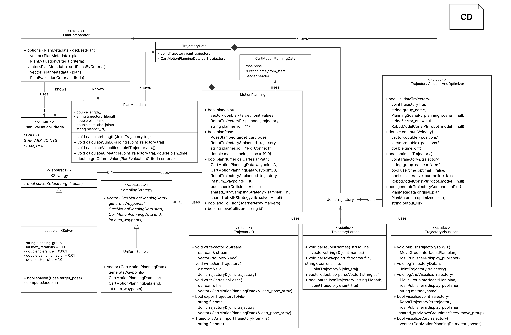

# Motion Planning Coding Challenge

A robotics motion planning implementation in ROS1 that demonstrates trajectory planning, optimization, and comparison across multiple planners using the MoveIt! framework.

## Overview

This project implements a `MotionPlanning` class that facilitates robot motion planning in both joint space and Cartesian space. The implementation includes trajectory comparison metrics, optimization techniques, and a custom numerical planner for cartesian path planning.

**Architecture:** A UML class diagram is included below for reference on class structure and relationships.




**Design Improvements:** The implementation emphasizes code organization, maintainability, and scalability through careful class refactoring and modular design.

---

## Task 1: Multi-Planner Trajectory Comparison

### Objective
Compare trajectory quality across multiple MoveIt! planners and identify the optimal planning algorithm.

### Implementation
1. Created MotionPlanning class with complete method implementations
2. Planned multiple trajectories (5 attempts) to a reachable Cartesian pose
3. Evaluated trajectories using configurable metrics:
   - Path length
   - Joint space effort (sum of absolute joint values)
   - Planning time
4. Ranked planners by weighted metric criteria
5. Executed the best trajectory

### Results

**Source Code:** `src/neura_motion_planning_challenge/src/Executables/task_one.cpp`

**Demo Video:** `src/neura_motion_planning_challenge/docs/task_one_demo.mp4`

**Planner Rankings (best to worst):** (each time, the numbers differ, this is only an example of one test)

| Rank | Planner | Path Length | Joint Effort | Time (s) |
|------|---------|-------------|--------------|----------|
| 1 | RRT | 2.071 | 73.520 | 0.680 |
| 2 | LBKPIECE | 2.085 | 73.550 | 0.638 |
| 3 | RRTConnect | 2.106 | 73.695 | 0.626 |
| 4 | RRTstar | 2.868 | 96.707 | 10.613 |
| 5 | BKPIECE | 7.719 | 311.572 | 0.835 |

**Best Planner:** RRT based on length as "PlanCriteria"
- **Selected Trajectory:** `trajectories/task_one_RRT_trajectory.yaml`


**Performance Note:** Visualization uses CPU-only rendering due to WSL2 and ROS1 compatibility constraints with GPU acceleration in RViz.

---

## Task 2: Trajectory Optimization & Analysis

### Objective
Analyze and optimize provided trajectories, implementing comparison utilities and visualization tools.

### Implementation
1. Created trajectory analysis framework
2. Implemented optimization algorithms (trajectory smoothing, waypoint refinement)
3. Developed trajectory comparison utilities:
   - Pre/post-optimization metrics
   - Multi-dimensional trajectory analysis
   - Efficiency improvement quantification
4. Generated comparative visualizations

### Results

**Source Code:** `src/neura_motion_planning_challenge/src/Executables/Task_Two.cpp`

**Output Charts:** `src/neura_motion_planning_challenge/utils/trajectory_comparison.png`

The analysis module provides:
- Before/after optimization comparisons
- Trajectory quality metrics
- Visual performance improvements
- Efficiency gains quantification

---

## Task 3: Numerical Cartesian Path Planner (Optional)

### Objective
Implement a custom numerical planner for cartesian path generation without relying on MoveIt!'s built-in planners.

### Implementation
1. Developed numerical inverse kinematics solver
2. Implemented waypoint-based path interpolation
3. Created cartesian trajectory generator

### Results

**Source Code:** `src/neura_motion_planning_challenge/src/Executables/Task_Optional.cpp`

**Demo Video:** `src/neura_motion_planning_challenge/docs/task_three_demo.mp4`

**Limitations:** 
- Numerical planner does not currently handle singular robot configurations
- Designed for general-purpose cartesian path planning without singularity avoidance

---

## Project Structure

```
src/neura_motion_planning_challenge/
├── CMakeLists.txt
├── package.xml
├── include/              # Header files
│   └── neura_motion_planning_challenge/
│       ├── DataStructure/
│       ├── Planning/
│       ├── Trajectory/
│       ├── Sampling/
│       ├── InverseKinematics/
│       └── Utility/
├── src/                  # Source implementation
│   ├── DataStructure/
│   ├── Planning/
│   ├── Trajectory/
│   ├── Sampling/
│   ├── InverseKinematics/
│   ├── Utility/
│   └── Executables/
│       ├── task_one.cpp
│       ├── Task_Two.cpp
│       └── Task_Optional.cpp
├── trajectories/         # Saved trajectory files
├── utils/                # Utility functions
│   └── trajectory_comparison/    # Analysis outputs
├── docs/                 # Documentation
│   ├── uml_diagram.png
│   ├── task_one_demo.mp4
│   └── task_three_demo.mp4
└── resource_debians/     # Robot configurations
```

## Usage

### Task 1: Run Planner Comparison
```bash
cd ~/coding_challenge
source devel/setup.bash
rosrun neura_motion_planning_challenge task_one
```

### Task 2: Trajectory Optimization Analysis
```bash
source devel/setup.bash
rosrun neura_motion_planning_challenge task_two
```

### Task 3: Numerical Planner Demo
```bash
source devel/setup.bash
rosrun neura_motion_planning_challenge task_optional
```


## Notes

- All trajectories are saved in YAML format for easy inspection and reuse
- Comparison metrics can be customized based on application-specific requirements
- The project includes comprehensive documentation via UML diagrams
- Visualization performance is optimized for CPU-based rendering environments


